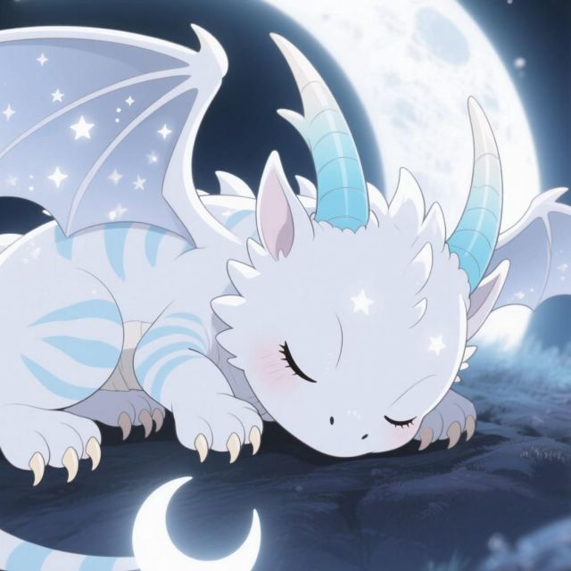
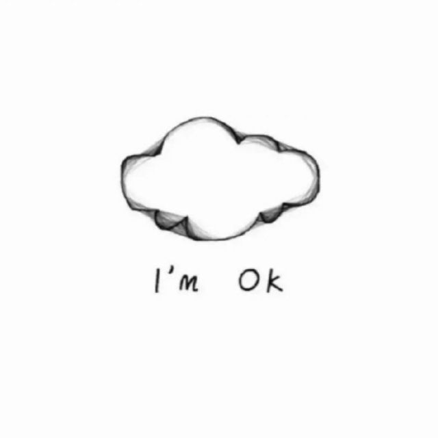
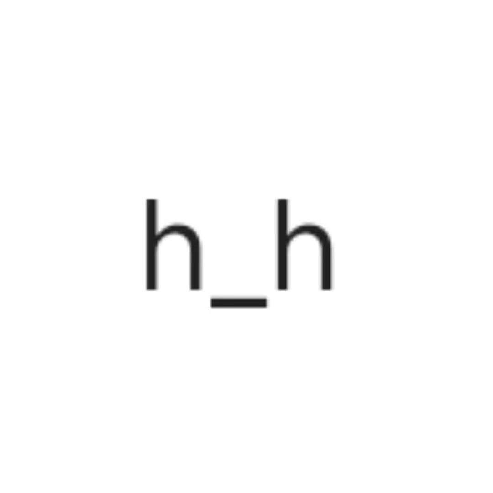
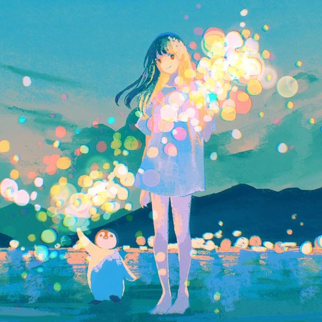

---
hide:
  - read-metrics
---

# 友链

在不同地方写字、折腾技术，也偶尔互相串门。

  <a class="friend-card" href="https://www.zt2misay2.cn/" target="_blank" rel="noopener noreferrer"><strong>Misay's Blog</strong><small>@Misay</small>呃啊</a>
  <a class="friend-card" href="https://lunereal.1kal0vic.top/" target="_blank" rel="noopener noreferrer"><strong>ika's blog</strong><small>@ikalovic</small>想混吃等死却睡死了过去</a>
  <a class="friend-card" href="https://0n3-0.github.io/" target="_blank" rel="noopener noreferrer"><strong>one's blog</strong><small>@one</small>Pwn everything.</a>
  <a class="friend-card" href="https://kuri.jwmc.top/" target="_blank" rel="noopener noreferrer"><strong>Kuri's Blog</strong><small>@Kuri</small>早安咕，午安咕，晚安咕咕咕</a>
  <a class="friend-card" href="https://oldmaple.top/" target="_blank" rel="noopener noreferrer"><strong>Maple's Blog</strong><small>@Maple</small>独坐青天钓沧海，空依月桂看合离</a>
  <a class="friend-card" href="https://b1ank799.github.io/" target="_blank" rel="noopener noreferrer"><strong>Blank's Blog</strong><small>@Blank</small>困</a>
  <a class="friend-card" href="https://lightcloveyou.github.io/" target="_blank" rel="noopener noreferrer"><strong>LightC's Blog</strong><small>@LightC</small>PWN your Heart</a>
  <a class="friend-card" href="https://crisq.top/" target="_blank" rel="noopener noreferrer"><strong>Cris.Q's Blog</strong><small>@Cris.Q</small>你没有义务成为天才</a>
  <a class="friend-card" href="https://huangoxygen.github.io/" target="_blank" rel="noopener noreferrer"><strong>huangoxygen's blog</strong><small>@huangoxygen</small>一口吃不成个胖子，但一口一口可以</a>
  <a class="friend-card" href="https://dicaeopolis.github.io/" target="_blank" rel="noopener noreferrer"><strong>Dicaeopolis's Wiki</strong><small>@Dicaeopolis</small>覚めるのであれば、どんな現実だって、夢でしかありません。覚めないとしたら、それが現実…</a>

