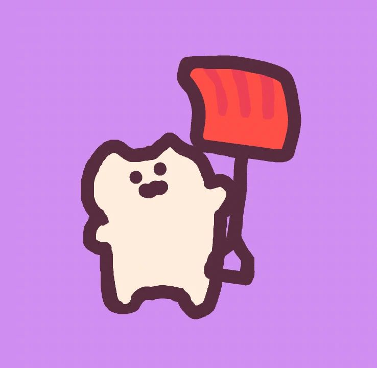
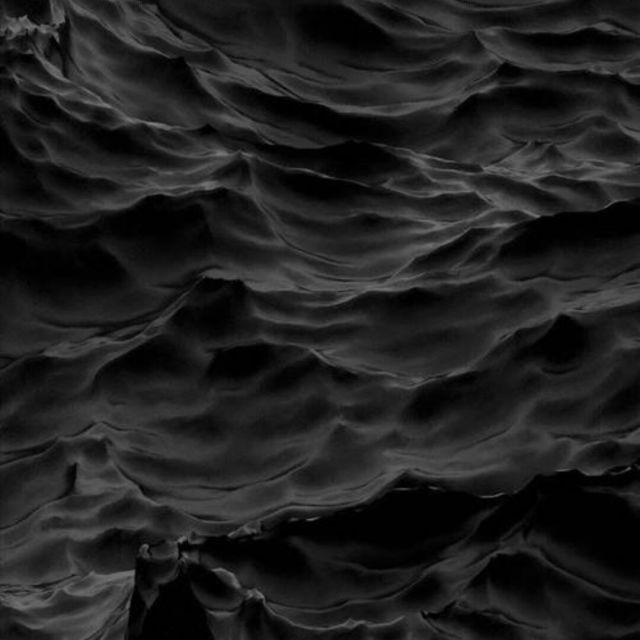
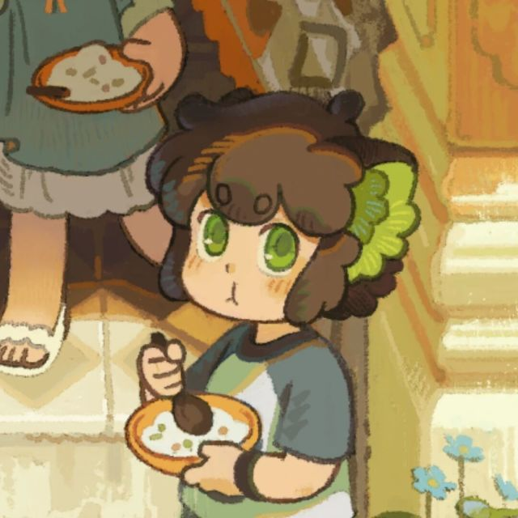
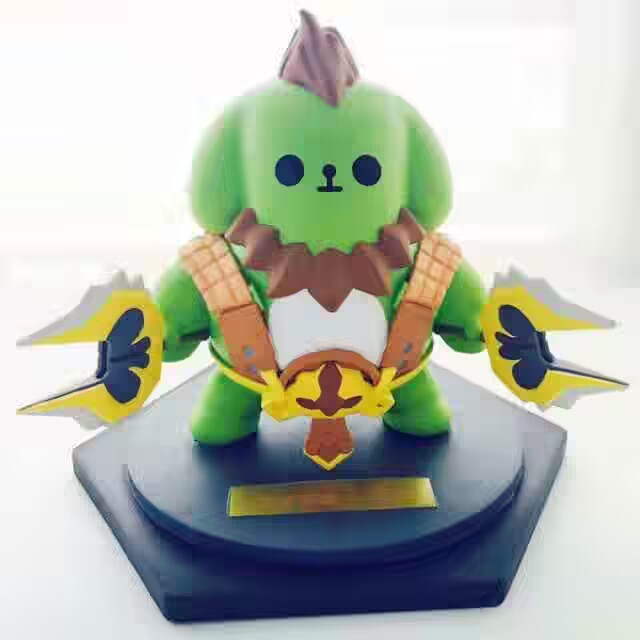

---
hide:
  - navigation
  - toc
---

# 友链样式对比

三套方案使用相同的 10 条真实友链数据和统一的新配色。可以切换深浅主题并缩窄窗口比较响应式表现。

  <section class="friend-option">
    <h2>A · 漂浮头像卡</h2>
    
头像成为视觉中心，整体更轻松、活泼。

    

      <a class="friend-card" href="https://www.zt2misay2.cn/" target="_blank" rel="noopener noreferrer"><strong>Misay's Blog</strong><small>@Misay</small>呃啊</a>
      <a class="friend-card" href="https://lunereal.1kal0vic.top/" target="_blank" rel="noopener noreferrer"><strong>ika's blog</strong><small>@ikalovic</small>想混吃等死却睡死了过去</a>
      <a class="friend-card" href="https://0n3-0.github.io/" target="_blank" rel="noopener noreferrer"><strong>one's blog</strong><small>@one</small>Pwn everything.</a>
      <a class="friend-card" href="https://kuri.jwmc.top/" target="_blank" rel="noopener noreferrer"><strong>Kuri's Blog</strong><small>@Kuri</small>早安咕，午安咕，晚安咕咕咕</a>
      <a class="friend-card" href="https://oldmaple.top/" target="_blank" rel="noopener noreferrer"><strong>Maple's Blog</strong><small>@Maple</small>独坐青天钓沧海，空依月桂看合离</a>
      <a class="friend-card" href="https://b1ank799.github.io/" target="_blank" rel="noopener noreferrer"><strong>Blank's Blog</strong><small>@Blank</small>困</a>
      <a class="friend-card" href="https://lightcloveyou.github.io/" target="_blank" rel="noopener noreferrer"><strong>LightC's Blog</strong><small>@LightC</small>PWN your Heart</a>
      <a class="friend-card" href="https://crisq.top/" target="_blank" rel="noopener noreferrer"><strong>Cris.Q's Blog</strong><small>@Cris.Q</small>你没有义务成为天才</a>
      <a class="friend-card" href="https://huangoxygen.github.io/" target="_blank" rel="noopener noreferrer"><strong>huangoxygen's blog</strong><small>@huangoxygen</small>一口吃不成个胖子，但一口一口可以</a>
      <a class="friend-card" href="https://dicaeopolis.github.io/" target="_blank" rel="noopener noreferrer"><strong>Dicaeopolis's Wiki</strong><small>@Dicaeopolis</small>覚めるのであれば、どんな現実だって、夢でしかありません。覚めないとしたら、それが現実…</a>
    

  </section>

  <section class="friend-option">
    <h2>B · 横向身份卡</h2>
    
头像与信息并列，长短简介都更容易阅读。

    

      <a class="friend-card" href="https://www.zt2misay2.cn/" target="_blank" rel="noopener noreferrer"><strong>Misay's Blog</strong><small>@Misay</small>呃啊</a>
      <a class="friend-card" href="https://lunereal.1kal0vic.top/" target="_blank" rel="noopener noreferrer"><strong>ika's blog</strong><small>@ikalovic</small>想混吃等死却睡死了过去</a>
      <a class="friend-card" href="https://0n3-0.github.io/" target="_blank" rel="noopener noreferrer"><strong>one's blog</strong><small>@one</small>Pwn everything.</a>
      <a class="friend-card" href="https://kuri.jwmc.top/" target="_blank" rel="noopener noreferrer"><strong>Kuri's Blog</strong><small>@Kuri</small>早安咕，午安咕，晚安咕咕咕</a>
      <a class="friend-card" href="https://oldmaple.top/" target="_blank" rel="noopener noreferrer"><strong>Maple's Blog</strong><small>@Maple</small>独坐青天钓沧海，空依月桂看合离</a>
      <a class="friend-card" href="https://b1ank799.github.io/" target="_blank" rel="noopener noreferrer"><strong>Blank's Blog</strong><small>@Blank</small>困</a>
      <a class="friend-card" href="https://lightcloveyou.github.io/" target="_blank" rel="noopener noreferrer"><strong>LightC's Blog</strong><small>@LightC</small>PWN your Heart</a>
      <a class="friend-card" href="https://crisq.top/" target="_blank" rel="noopener noreferrer"><strong>Cris.Q's Blog</strong><small>@Cris.Q</small>你没有义务成为天才</a>
      <a class="friend-card" href="https://huangoxygen.github.io/" target="_blank" rel="noopener noreferrer"><strong>huangoxygen's blog</strong><small>@huangoxygen</small>一口吃不成个胖子，但一口一口可以</a>
      <a class="friend-card" href="https://dicaeopolis.github.io/" target="_blank" rel="noopener noreferrer"><strong>Dicaeopolis's Wiki</strong><small>@Dicaeopolis</small>覚めるのであれば、どんな現実だって、夢でしかありません。覚めないとしたら、それが現実…</a>
    

  </section>

  <section class="friend-option">
    <h2>C · 极简名片墙</h2>
    
信息更紧凑，悬停或键盘聚焦时加强当前卡片。

    

      <a class="friend-card" href="https://www.zt2misay2.cn/" target="_blank" rel="noopener noreferrer"><strong>Misay's Blog</strong><small>@Misay</small>呃啊</a>
      <a class="friend-card" href="https://lunereal.1kal0vic.top/" target="_blank" rel="noopener noreferrer"><strong>ika's blog</strong><small>@ikalovic</small>想混吃等死却睡死了过去</a>
      <a class="friend-card" href="https://0n3-0.github.io/" target="_blank" rel="noopener noreferrer"><strong>one's blog</strong><small>@one</small>Pwn everything.</a>
      <a class="friend-card" href="https://kuri.jwmc.top/" target="_blank" rel="noopener noreferrer"><strong>Kuri's Blog</strong><small>@Kuri</small>早安咕，午安咕，晚安咕咕咕</a>
      <a class="friend-card" href="https://oldmaple.top/" target="_blank" rel="noopener noreferrer"><strong>Maple's Blog</strong><small>@Maple</small>独坐青天钓沧海，空依月桂看合离</a>
      <a class="friend-card" href="https://b1ank799.github.io/" target="_blank" rel="noopener noreferrer"><strong>Blank's Blog</strong><small>@Blank</small>困</a>
      <a class="friend-card" href="https://lightcloveyou.github.io/" target="_blank" rel="noopener noreferrer"><strong>LightC's Blog</strong><small>@LightC</small>PWN your Heart</a>
      <a class="friend-card" href="https://crisq.top/" target="_blank" rel="noopener noreferrer"><strong>Cris.Q's Blog</strong><small>@Cris.Q</small>你没有义务成为天才</a>
      <a class="friend-card" href="https://huangoxygen.github.io/" target="_blank" rel="noopener noreferrer"><strong>huangoxygen's blog</strong><small>@huangoxygen</small>一口吃不成个胖子，但一口一口可以</a>
      <a class="friend-card" href="https://dicaeopolis.github.io/" target="_blank" rel="noopener noreferrer"><strong>Dicaeopolis's Wiki</strong><small>@Dicaeopolis</small>覚めるのであれば、どんな現実だって、夢でしかありません。覚めないとしたら、それが現実…</a>
    

  </section>

